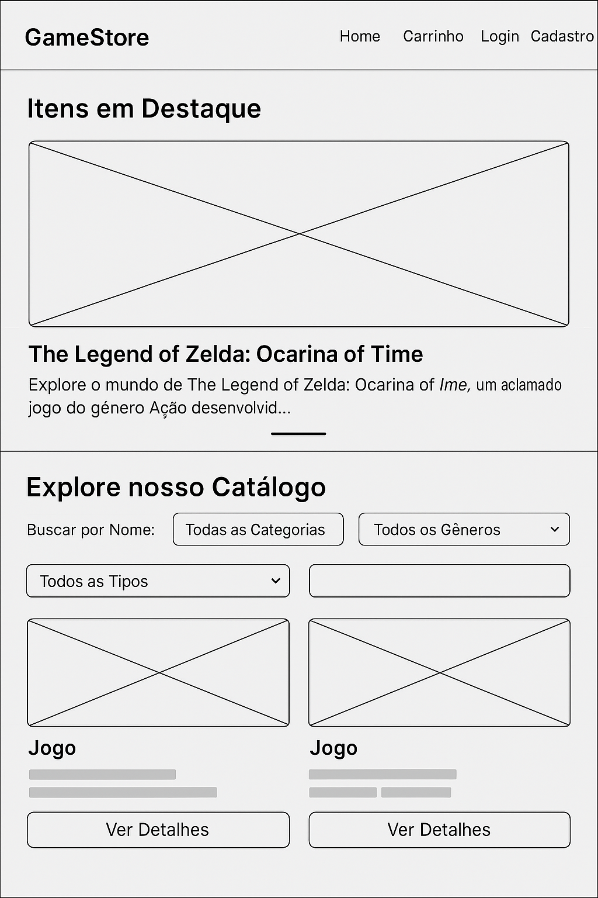
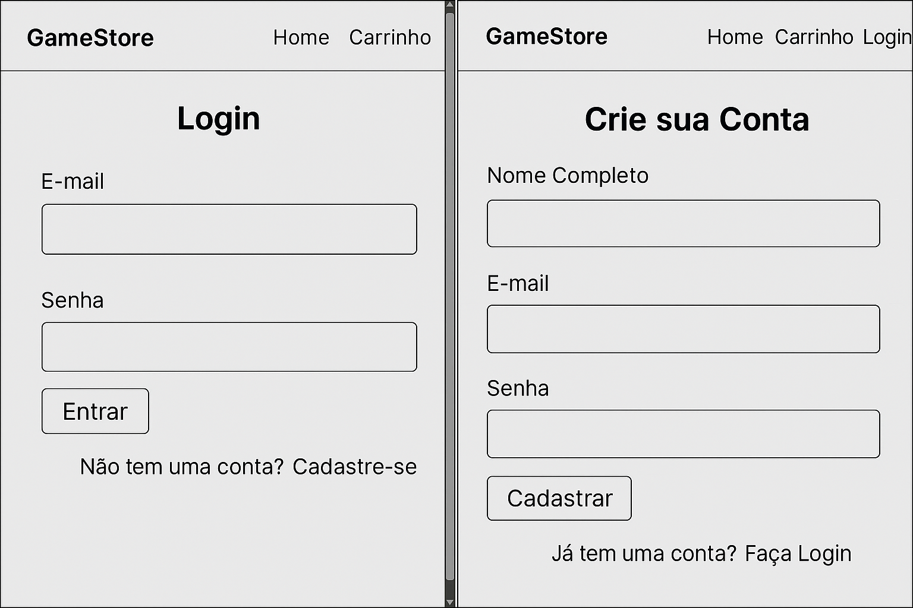
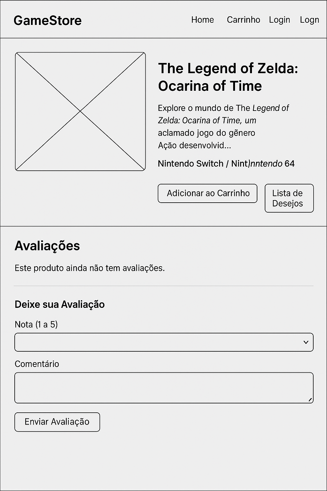
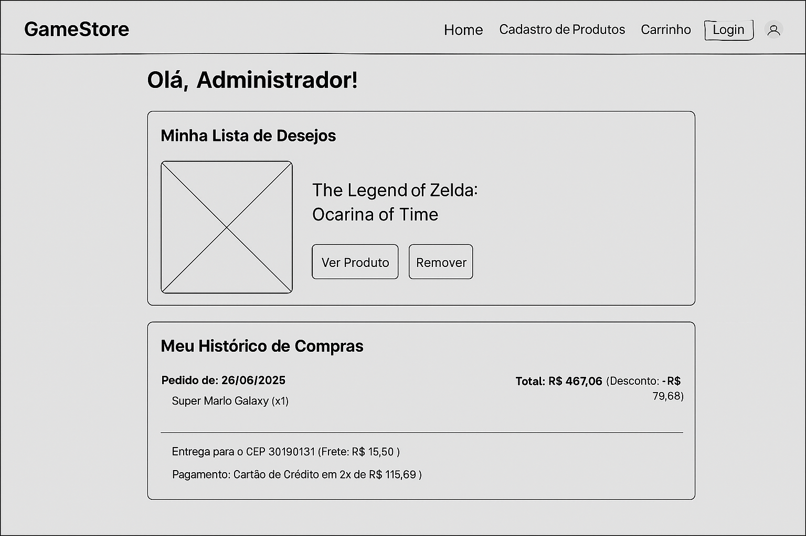

# Projeto de Interface

A interface da plataforma foi projetada para traduzir visualmente os requisitos do projeto e as histórias de usuário. O design atende às necessidades funcionais, como navegação e filtragem por categoria e preço, e a exibição de informações detalhadas dos produtos, incluindo avaliações, conforme solicitado pelos usuários. Elementos como o carrinho de compras e a gestão de contas foram simplificados para garantir um fluxo intuitivo. Em relação aos requisitos não funcionais, a interface foi construída com tecnologias web padrão (HTML, CSS, JavaScript) para ser responsiva e compatível com diversos navegadores, além de operar sobre HTTPS para garantir a segurança das transações. Abaixo estão o fluxo de usuários e as wireframes.

## User Flow

Fluxo de Usuário

## Wireframes

Homepage, Navegação Principal, Catálogos, Busca e Filtro

Cadastro e Login

Página de Detalhes do Produto e Sistema de Avaliação e Comentários

Carrinho de Compras e Cupom de Desconto

Fluxo de Checkout e Confirmação de Compra

Lista de Desejos e Histórico de Compras

Gerenciamento de Produtos
