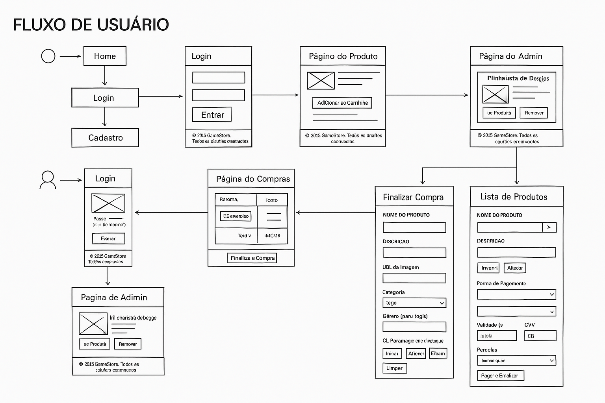
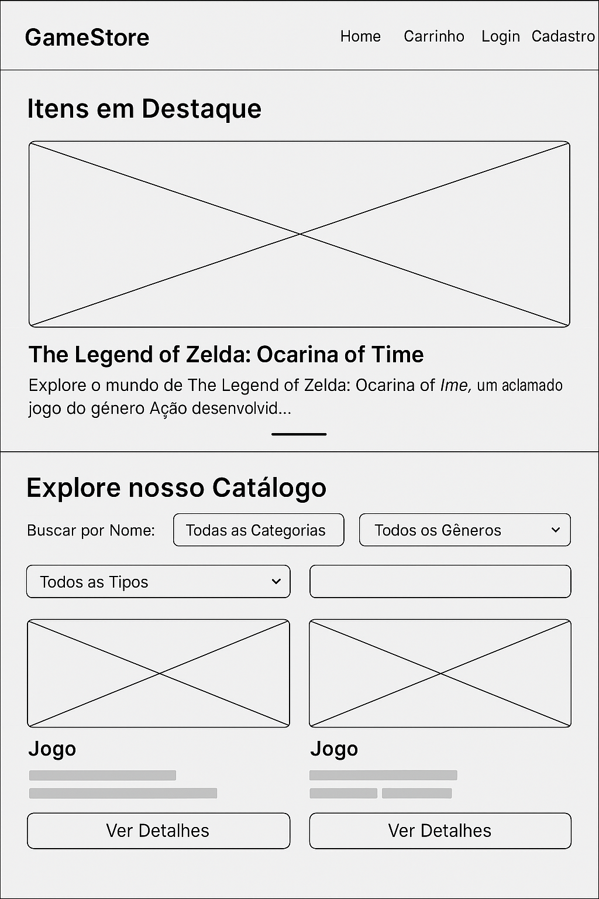
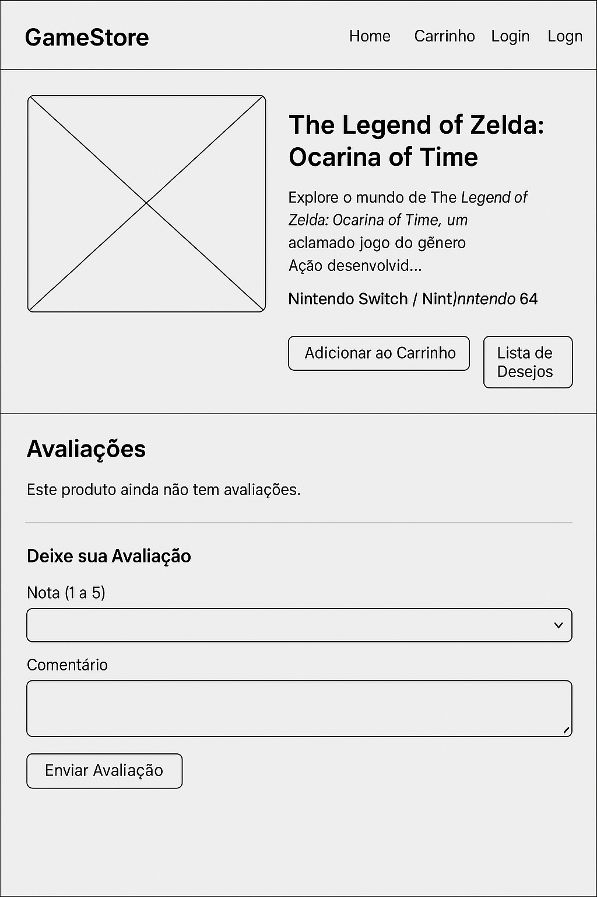
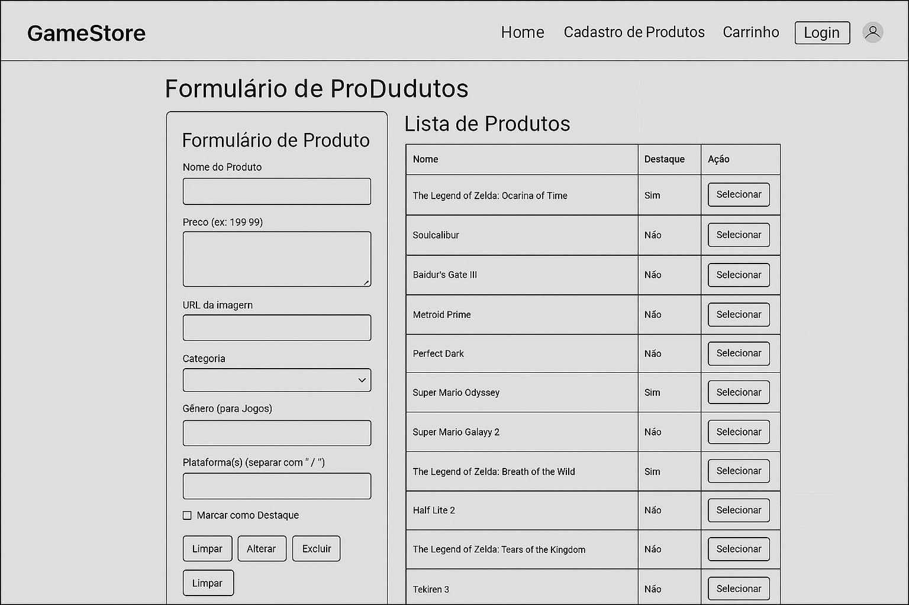
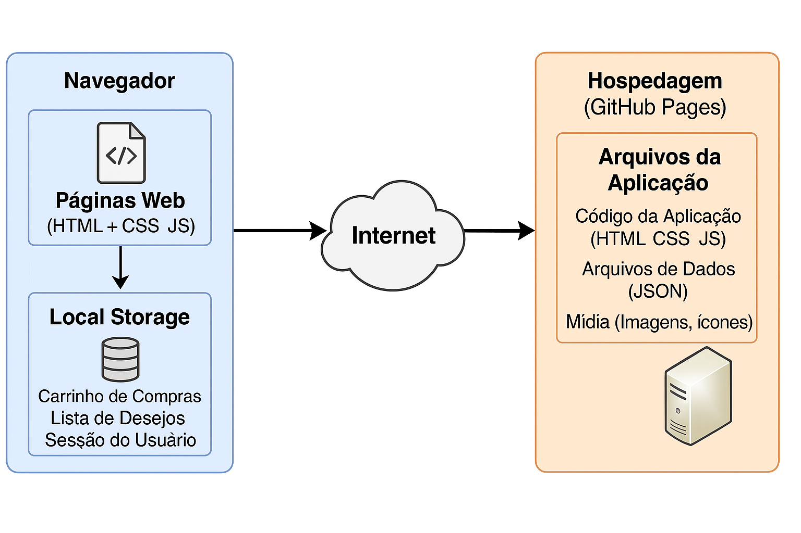

# Projeto da Solução

## Tecnologias Utilizadas

Para o desenvolvimento do nosso site de venda de jogos e acessórios, selecionamos um conjunto de tecnologias e ferramentas modernas e eficientes, focadas em agilidade, robustez e colaboração. A escolha de cada componente foi pensada para atender aos requisitos do projeto e facilitar o ciclo de vida do desenvolvimento.

### Linguagens e Estrutura de Dados

* **HTML5:** Utilizado para a estruturação semântica de todas as páginas do site, garantindo uma base sólida, acessível e bem interpretada pelos navegadores e mecanismos de busca.
* **CSS3:** Empregado para a estilização completa da interface, incluindo layouts, cores, fontes e animações. O uso do CSS3, combinado com o Bootstrap, permite a criação de um design visualmente atraente e consistente.
* **JavaScript (ES6+):** Essencial para adicionar interatividade e dinamismo à experiência do usuário. O JavaScript é responsável por ler e manipular os dados em JSON, gerenciar eventos, validar formulários e atualizar a interface dinamicamente.
* **JSON (JavaScript Object Notation):** Utilizado como o formato padrão para estruturar os dados da aplicação, como o catálogo de produtos, informações de usuários e itens do carrinho. Por ser leve e de fácil interpretação pelo JavaScript, o JSON funciona como uma base de dados local no lado do cliente.

### Frameworks e Bibliotecas

* **Bootstrap 5:** Escolhido como nosso principal framework de front-end. Sua abordagem *mobile-first* e o sistema de grid responsivo foram cruciais para garantir que o site funcione perfeitamente em qualquer dispositivo (desktops, tablets e smartphones). Além disso, sua vasta biblioteca de componentes pré-construídos (como modais, menus de navegação e alertas) acelerou significativamente o desenvolvimento da interface.

### Ferramentas de Desenvolvimento, Design e Gerenciamento

* **Visual Studio Code (VS Code):** Adotado como o editor de código padrão para toda a equipe. Sua leveza, performance e, principalmente, seu vasto ecossistema de extensões para desenvolvimento web (como Live Server, Prettier e ESLint) otimizam a produtividade e a padronização do código.
* **Figma:** Ferramenta central para o design da interface e da experiência do usuário (UI/UX). Foi utilizada para criar os wireframes, protótipos navegáveis e o fluxo de usuário, permitindo a visualização e validação das telas antes mesmo do início da codificação.
* **Git & GitHub:** O Git foi utilizado para o controle de versionamento local, permitindo um rastreamento detalhado de todas as alterações no código. O GitHub funcionou como nosso repositório remoto, centralizando o código-fonte e facilitando a colaboração, a revisão de código entre os membros da equipe através de *Pull Requests* e o gerenciamento seguro do projeto.
* **Trello:** Empregado para o gerenciamento ágil do projeto, seguindo a metodologia Scrum. As tarefas de cada Sprint foram organizadas em quadros Kanban, proporcionando uma visão clara do andamento, das responsabilidades e dos prazos.

---

## 🗺️ 1. Fluxo de Usuário

A imagem abaixo representa o fluxo completo de navegação do usuário, tanto para visitantes quanto para usuários logados e administradores.

**Principais caminhos:**
- Visitantes: Home, Catálogo, Detalhes do Produto, Cadastro e Login.
- Usuários Logados: Carrinho, Checkout, Lista de Desejos, Histórico de Compras e Perfil.
- Administradores: Acesso ao painel de Gerenciamento de Produtos.

> O fluxo mostra como um usuário pode:
> Buscar um produto → Ver detalhes → Adicionar ao carrinho → Finalizar compra → Visualizar histórico ou gerenciar conta.

---

## 🏠 2. Homepage, Navegação Principal, Catálogos, Busca e Filtro

### Funcionalidades:
- Menu de navegação no topo: **Home**, **Carrinho**, **Login**, **Cadastro** (ou **Perfil/Sair** se logado).
- Exibição de jogos em destaque.
- Campo de **busca** e filtros por **gênero, categoria ou plataforma**.
- Visual responsivo e intuitivo com contraste de cores (tema escuro + roxo).

> Esta página é o ponto de partida do usuário e promove a descoberta de produtos com navegação facilitada.

---

## 🔐 3. Cadastro e Login

### Login:
- Campos: **E-mail**, **Senha**.
- Botão: `Entrar`
- Link para **cadastro**.

### Cadastro:
- Campos: **Nome completo**, **E-mail**, **Senha**.
- Botão: `Cadastrar`
- Link para **login**.

> Interface simples e clara, garantindo fluidez no fluxo de autenticação do usuário.

---

## 📄 4. Página de Detalhes do Produto e Sistema de Avaliação

### Conteúdo exibido:
- Imagem e descrição detalhada.
- Preço e informações sobre a plataforma.
- Botões:
  - `Adicionar ao Carrinho`
  - `Adicionar à Lista de Desejos`
- Avaliações:
  - Notas de 1 a 5 estrelas.
  - Campo de comentário.
  - Botão `Enviar`.

> Essencial para tomada de decisão do usuário antes da compra. O sistema de reviews agrega valor e confiabilidade.

---

## 🛒 5. Carrinho de Compras e Cupom de Desconto

### Elementos:
- Lista dos itens com imagem, nome, preço, quantidade.
- Botão `Remover` para cada item.
- Campo de cupom e botão `Aplicar`.
- Subtotal e total atualizados dinamicamente.
- Botão `Finalizar Compra` com destaque visual.

> Esta seção permite revisão do pedido e aplicação de promoções antes da finalização da compra.

---

## 💳 6. Fluxo de Checkout e Confirmação de Compra

### Dividido em:
#### 🧾 Resumo do Pedido
- Lista de itens + subtotal e total.

#### 📍 Endereço de Entrega
- Campo de **CEP** e botão `Calcular Frete`.

#### 💳 Forma de Pagamento
- Opções: **Pix**, **Cartão de Crédito**, **Cartão de Débito**.
- Campos:
  - Número do cartão
  - Nome no cartão
  - Validade (MM/AA)
  - CVV
  - Parcelamento
- Botão `Pagar e Finalizar`

> Processo completo, funcional e compatível com práticas modernas de e-commerce.

---

## ❤️ 7. Lista de Desejos e Histórico de Compras

### Lista de Desejos:
- Exibe produtos salvos.
- Botões: `Ver Produto` e `Remover`.

### Histórico de Compras:
- Mostra pedidos com:
  - Data da compra
  - Itens e chaves de ativação
  - Frete, método de pagamento e status

> Facilita a recompra, gestão e interesse contínuo pelos produtos.

---

## 🧑‍💼 8. Gerenciamento de Produtos

### Formulário de Produto:
- Campos:
  - Nome
  - Preço
  - Descrição
  - URL da Imagem
  - Categoria
  - Gênero
  - Plataformas
  - Checkbox: **Marcar como destaque**
- Botões: `Inserir`, `Alterar`, `Excluir`

### Lista de Produtos:
- Tabela com:
  - Nome
  - Se é destaque
  - Botão `Selecionar` para edição

> Área de controle para administradores, com operações CRUD simples para manter o catálogo sempre atualizado.

---

## ✅ Considerações Finais

O sistema GameStore foi projetado com foco em:
- Navegação simples e clara
- Interfaces intuitivas e organizadas
- Acesso rápido aos principais recursos
- Experiência completa de compra para jogadores

> Todos os fluxos estão interligados de forma lógica e fluida, garantindo boa usabilidade tanto para usuários comuns quanto para administradores.

---

## Arquitetura da Solução

A arquitetura da solução foi projetada para ser simples, escalável e focada no cliente. Ela se baseia em uma arquitetura primariamente **Client-Side (Lado do Cliente)**, onde a lógica de apresentação e a manipulação de dados são executadas diretamente no navegador do usuário.

O diagrama abaixo ilustra a interação do usuário com o sistema e as tecnologias envolvidas em cada etapa:

**Descrição dos Componentes:**

1.  **Cliente (Navegador):** É a camada de apresentação, onde o usuário interage com o site. O navegador renderiza os arquivos HTML, aplica os estilos do CSS e executa os scripts JavaScript para criar uma experiência dinâmica. Toda a interface responsiva é garantida pelo framework Bootstrap.

2.  **Dados da Aplicação (JSON & Local Storage):** Como a aplicação não possui um back-end tradicional, os dados são gerenciados no lado do cliente.
    * **Arquivos JSON:** O catálogo de produtos (jogos, acessórios) é armazenado em arquivos `.json`. O JavaScript lê esses arquivos para exibir dinamicamente o conteúdo nas páginas da loja.
    * **Local Storage:** Para dados que precisam persistir na sessão do usuário, como os itens do carrinho de compras e a lista de desejos, utilizamos o *Local Storage* do navegador.

3.  **Hospedagem (GitHub Pages):** Todos os arquivos estáticos da aplicação (HTML, CSS, JS, JSON, imagens) são hospedados em uma plataforma como o GitHub Pages. Ela é responsável por disponibilizar o site de forma pública e contínua, integrada ao nosso fluxo de desenvolvimento no repositório.

Essa arquitetura permite um desenvolvimento rápido e com baixo custo de hospedagem, ao mesmo tempo que oferece uma experiência rica e interativa para o usuário final, sendo ideal para o escopo definido no projeto.

